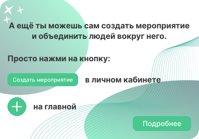
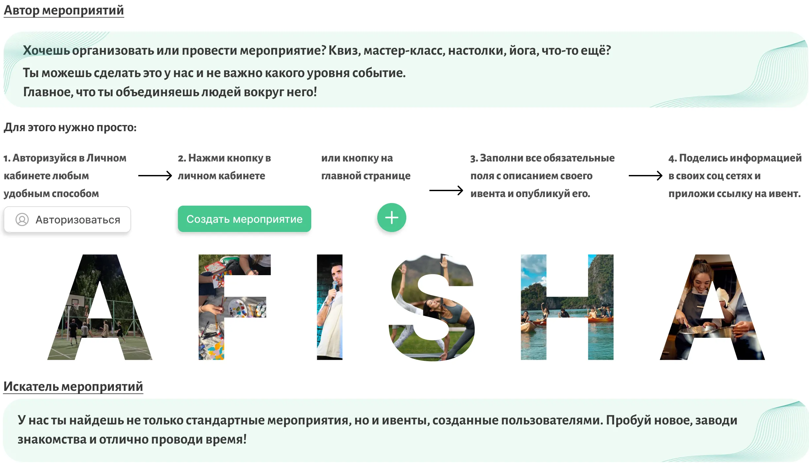
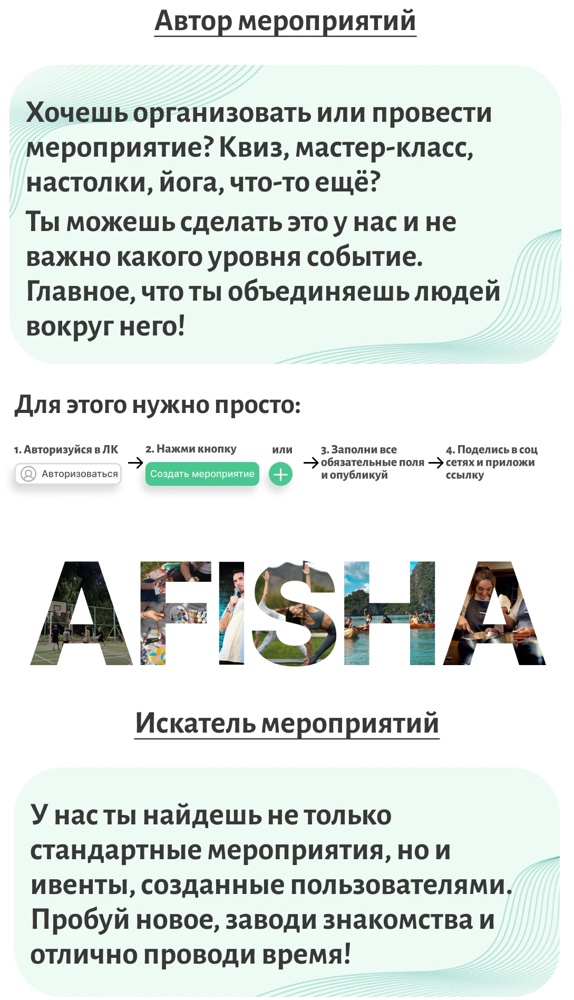
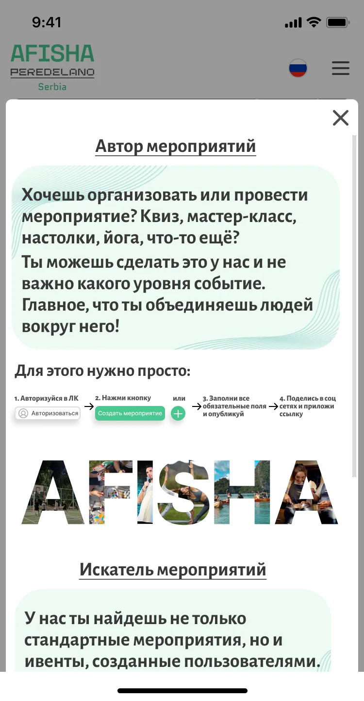
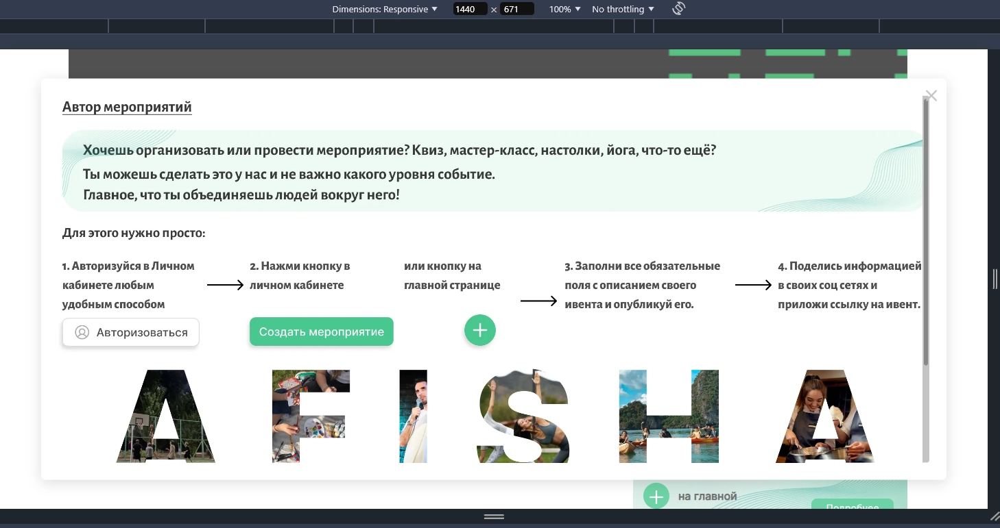
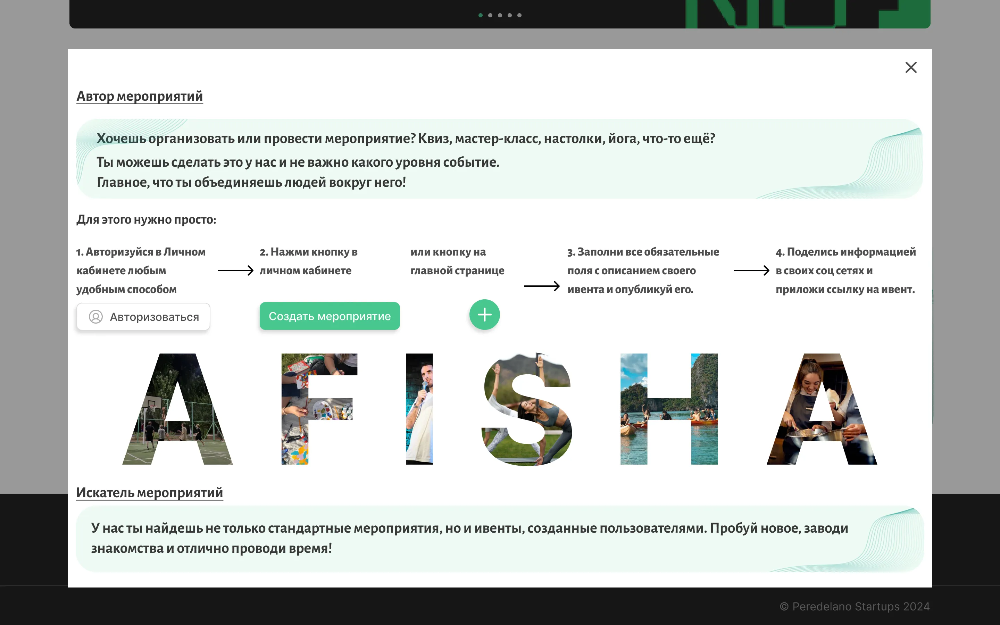

### [← На страницу документации](../../../../ru-documentation.md)

---

Модальное окно появляется при нажатии кнопки **"Подробнее"** на информационном баннере

---

### Содержит в себе:

-   #### Кнопку закрытия а правом верхнем углу
    -   Десктоп
        -   Всегда Кликабельная зеленая - это баг, я пока не знаю как исправить
    -   Мобильная
        -   Серая кнопка
-   #### Информацию о создании ивента в виде картинки в формате .webp

    -   

            
 ⬇️ ДЕСКТОП ⬇️ 

                
        

    -   

              
 ⬇️ МОБИЛЬНАЯ ⬇️ 

                  
        

---

### Поведение окна

-   Мобильное устройство

    -   

         
 Появление: Снизу экрана ⬇️ 

                  
        

    -   

         
 Примечание Горизонтальная ⬇️ ❗ 

                 

                 ПРИМЕЧАНИЕ! При узком разрешении где соотношение сторон больше 32/15 и меньше 2000px будет появляться скролл при прокручивании (кейс - горизонтальное мобильное устройство)

         

    -   #### Размеры:
        -   Высота: 80vw
        -   Ширина: На всю ширину экрана
    -   При повороте экрана
        -   Картинка как на планшете
        -   Появляется кривой скролл(не трограем его - сделаем уже когда нибудь)
    -   ### Активности
        -   Можно закрыть по кнопке закрыть
        -   Можно закрыть по клику в свободной зоне
        -   Можно закрыть так же по пробелу внутри окна, по сути сработает крестик

-   Десктоп

    -   

            
 Появление: по центру экрана ⬇️ 

                
        

    -   #### Размеры:
        -   Высота: подстраиваемая под ширину
        -   Ширина: примерно 1270px

-   Планшет
    -   Появление: по центру экрана
    -   Поведение как и у десктопа

---

### [← На страницу документации](../../../../ru-documentation.md)
