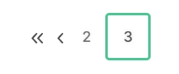
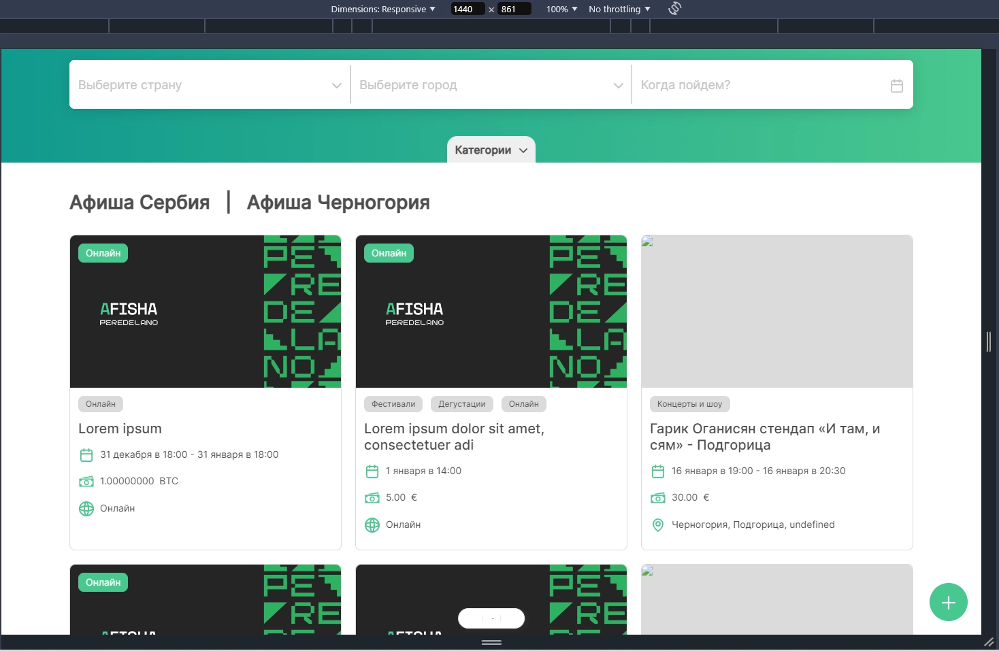

### [← На страницу документации](../../ru-documentation.md)
---

### Элементы пагинации находятся на:

-   Главной странице
-   Странице Страны
-   Странице Города

#### Примечание элемент пагинации содержит в себе (это костыль будем переписывать)
- #### Заголовки Афиша Сербия | Афиша Черногория и тд
- #### Список ивентов
- #### Блок пагинации описание ниже

---

### Блок пагинации содержит в себе:

-   #### Кнопку "Первая страница" - "<<"
-   #### Кнопку "Назад" - "<"
-   #### Кнопки "Номер страницы" - "2 3 4" - (**[Выделенная]**кнопка Отдельной страницы)
-   #### Кнопку "Вперед" - ">"
-   #### Кнопку "Последняя страница" - ">>"

 

### Изображения Компонента

-   

             
 ⬇️ МОБИЛЬНАЯ И ПЛАНШЕТ ⬇️ 

                 
                 
                
    

-   

            
 ⬇️ ДЕСКТОП ⬇️ 

                 
                 
                
    

---

### Поведение

-   #### Активности

    -   

        
 ⬇️ При нажатии на цифру или значок "<<" "<" ">" ">>" переход на нужную страницу ⬇️ 

                    -   "<<" - На ПЕРВУЮ страницу
                    -   "<" - На страницу назад
                    -   ">" - На страницу Вперед
                    -   ">>" - На ПОСЛЕДНЮЮ страницу

        

    -  #### При наведении (:hover) **❗СКРИНЫ ДЕСКТОПА❗**

        -   

            
 Активный элемент ⬇️ 

                        

                        -   Зеленая обводка
                        -   Зеленая тень снаружи
                        -   Жирность шрифта: 500
                        -   Прозрачность: 1

            

        -   

            
 Элемент ⬇️ 

                        

                        -   Зеленая обводка
                        -   Зеленая тень внутри и снаружи
                        -   Жирность шрифта: 500
                        -   Прозрачность: 1

            

    -  #### При фокусировании с помощью Tab (:focus) **❗СКРИНЫ ДЕСКТОПА❗**

        -   

            
 Активный элемент ⬇️ 

                        

                        -   Зеленая обводка
                        -   Зеленая тень снаружи
                        -   Жирность шрифта: 500
                        -   Прозрачность: 1

            

        -   

                   
 Элемент ⬇️ 

                        

                         -   Зеленая тень внутри и снаружи
                         -   Жирность шрифта: 500
                         -   Прозрачность: 1

            

    - #### Прокрутка при нажатии на другую страницу до фильтров Страны / Города
        -   

              
 Мобильное ⬇️ 

                  
            

        -   

              
 Десктоп ⬇️ 

                  
            

        -   

              
 Планшет ⬇️ 

                  
            
 

---

### Вид и Размеры
-   ### Мобильное устройство

    -   

              
 Появление: Сверху и Снизу экрана ⬇️ 

                  
        

    -   #### Размеры:
        #### Элемента
        -   Высота: 43px
        -   Ширина: 46px
        -   Жирность шрифта: 400
        -   Слабая тень на цифрах
        -   Прозрачность: 0.8
        #### Блока пагинации
        -   Высота: 43px
        -   Промежуток (gap): 8px
        -   Ширина: по количеству элементов + промежутки
    -   #### При повороте экрана
        -   Поведение как на планшете

-   ### Десктоп

    -   

            
 Появление: Снизу экрана ⬇️ 

                
        

    -   #### Размеры:
        #### Элемента
        -   Высота: 59px
        -   Ширина: 56px
        -   Жирность шрифта: 400
        -   Слабая тень на цифрах
        -   Прозрачность: 0.8
        #### Блока пагинации
        -   Высота: 59px
        -   Промежуток (gap): 8px
        -   Ширина: по количеству элементов + промежутки

-   ### Планшет
    -   

            
 Появление: Сверху и Снизу экрана ⬇️ 

                
        

    -   Размеры как у мобильной версии
    -   Поведение как у мобильной версии
    -   При повороте экрана - зависит от разрешения, если больше 1440 - как у десктопа

---
### [← На страницу документации](../../ru-documentation.md)
