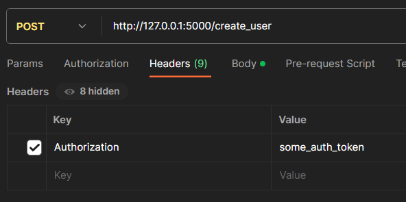
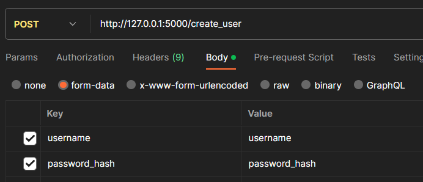
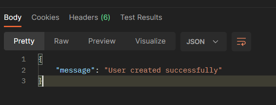

# ows-events-qr

# Environments
Create .env file and copy all environments from [.env.template](.env.template)

(Environments are configured by default to work with [docker-compose.yml](docker-compose.yml). Change them for your needs)

## How to start with docker
```bash
docker-compose up
 ```

## Start locally
1. Installation

    Pip installation:
    ```bash
    pip install -r requirements.txt
    ```

    Or you can use poetry as package manager:

    [Install Poetry globally](https://python-poetry.org/docs/#installing-with-the-official-installer) onto your system, or install it with pip:
    ```pip install poetry```

    Run this command:
    ```bash
    poetry install
    ```

2. Run project
    ```bash
    python start.py
    ```

3. First request
     
   1. Paste this url in postman: http://127.0.0.1:5000/create_user
   2. Create Authorization key in Headers with your AUTH environment in [.env](.env) file like this
       
   3. Open the form-data and create this key:value\
       
   4. Send a POST request and see this response\
       
